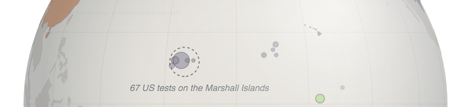
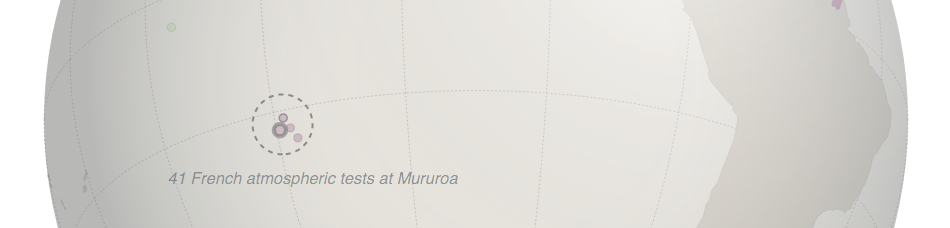
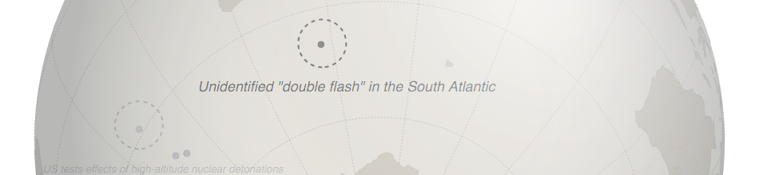
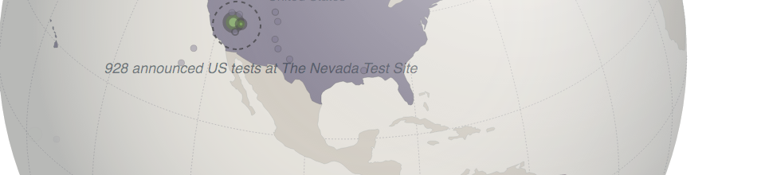
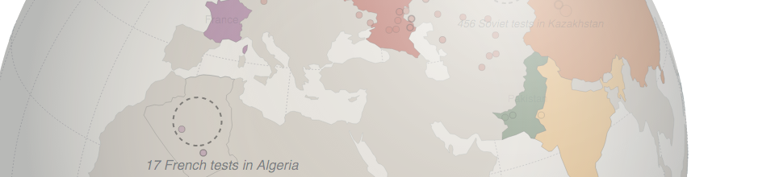

# Graphics

| For  | URL |
| ------------- | ------------- |
| Prototype (c) The Washington Post, 2016 | [Context Sensitive Labels (3D globe)][nuclear-testing]  |
| The Washington Post | [23 countries legalized same-sex marriage][same-sex]  |
| The Washington Post  | [Gigaton (Chris Mooney)][gigaton]  |
| The Washington Post  | [Reid's conservation legacy][OBAMAREID]  |
| The Washington Post  | [2015 Cy Young Tracker][cy-young-tracker]  |

## [Context Sensitive Cartographic Labels (3D globe)][nuclear-testing]

The idea here was to visualize nuclear testing throughout history on a 3D globe that responds to a user's mouse movement. One problem this experiment attempted to solve was the cluttering of labels that results when event, country, and state labels overlap. *Interactive* orthographic projection presents an opportunity to do something *different* with label placement: make labels context sensitive! Labels change size and opacity as their position changes within the viewport.

Several different gimbal-like mechanisms were experimented with. The rendering pipeline makes use of a prototype [library](https://github.com/bmershon/d3-chart-atlas) I created to help manage rendering and user-interaction for multiple geographic layers.

## [23 countries legalized same-sex marriage][same-sex]

**[Adobe Illustrator]**

## [Gigaton (Chris Mooney)][gigaton]

**[Adobe Illustrator]**

## [Reid's conservation legacy][OBAMAREID]

**[D3.js, Shapefiles, Make, TopoJSON]**

Harry Reid's conservation map was [assembled](https://github.com/bmershon/nevada-wilderness) from shapefiles and tabular data using Make. This automated process for rendering maps and computing total areas turned out to be very helpful as the story, and therefore the map itself, evolved in the days before publication. The map and bar graphs were first rendered with D3.js, then the base SVG was then exported to Adobe Illustator.

## [2015 Cy Young Tracker][cy-young-tracker]

**[D3.js, JavaScript, HTML/CSS, Templates, Excel]**

[same-sex]:https://www.washingtonpost.com/blogs/the-fix/wp/2015/06/26/the-u-s-just-joined-a-league-of-21-countries-in-which-gay-marriage-is-legal/

[gigaton]:http://wpo.st/M8rP0

[OBAMAREID]:http://wpo.st/V8rP0

[cy-young-tracker]: https://www.washingtonpost.com/graphics/sports/cy-young-tracker/

[nuclear-testing]: http://bl.ocks.org/bmershon/f84b7b31bc2ac92f2e30
