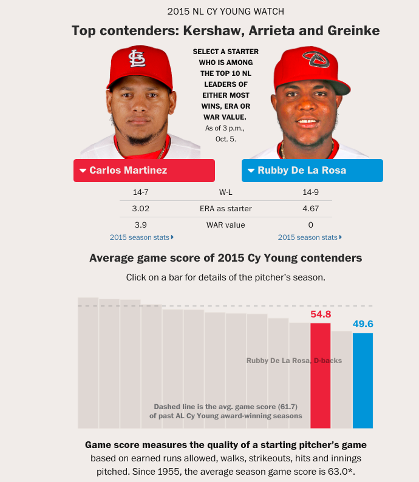

| For  | URL |
| ------------- | ------------- |
| The Washington Post | [23 countries legalized same-sex marriage][same-sex]  |
| The Washington Post  | [Gigaton (Chris Mooney)][gigaton]  |
| The Washington Post  | [Reid's conservation legacy][OBAMAREID]  |
| The Washington Post  | [2015 Cy Young Tracker][cy-young-tracker]  |

### [23 countries legalized same-sex marriage][same-sex]

### [Gigaton (Chris Mooney)][gigaton]

### [Reid's conservation legacy][OBAMAREID]

### [2015 Cy Young Tracker][cy-young-tracker]

[same-sex]:https://www.washingtonpost.com/blogs/the-fix/wp/2015/06/26/the-u-s-just-joined-a-league-of-21-countries-in-which-gay-marriage-is-legal/

[gigaton]:http://wpo.st/M8rP0

[OBAMAREID]:http://wpo.st/V8rP0

[cy-young-tracker]: https://www.washingtonpost.com/graphics/sports/cy-young-tracker/
